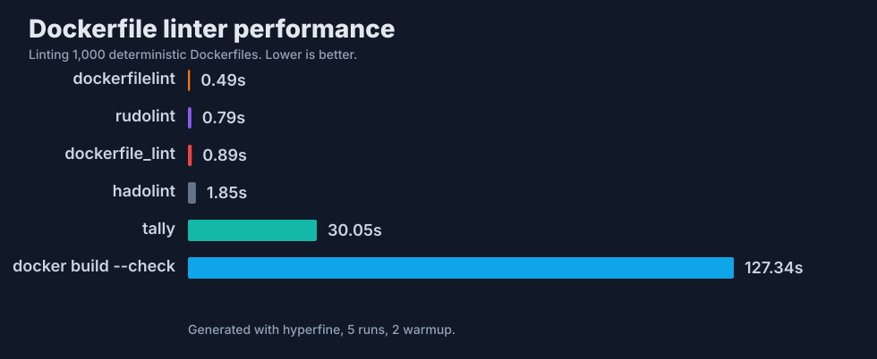

# rudolint

[](https://codspeed.io/kubeply/rudolint?utm_source=badge)

`rudolint` is a fast Dockerfile linter built for modern BuildKit and Buildx
workflows.



_Linting 1,000 deterministic Dockerfiles. Lower is better. See the full
[Dockerfile linter benchmark methodology](benchmarks/dockerfile-linters/README.md)._

The goal is a single static binary that understands current Dockerfile syntax,
emits CI-native diagnostics, and stays pleasant to run in pre-commit hooks,
editors, and large monorepos.

## Why

Dockerfile linting still matters, but Docker builds have moved on:

- BuildKit is the normal builder path for Docker Desktop and Docker Engine.
- `# syntax=docker/dockerfile:1.x` controls frontend behavior.
- `RUN --mount=type=cache` changes old package-cache advice.
- `RUN --mount=type=secret` and `--mount=type=ssh` need security-aware linting.
- heredocs and multi-stage builds deserve parser-level support.
- CI systems expect JSON, SARIF, and stable rule IDs.

`rudolint` starts from those assumptions instead of treating them as edge cases.

## Current Status

This repository is a baseline implementation. It already has:

- a Rust CLI with `check` and `rules` commands
- recursive Dockerfile discovery
- BuildKit syntax directive detection
- parsing for instruction flags, mounts, heredocs, and stage aliases
- human, JSON, and SARIF output
- a rule engine with default and compatibility profiles
- initial Dockerfile rules and BuildKit-specific rules
- ignored rules and severity overrides through `.rudolint.yaml`
- ignored parity-test scaffolding for comparing behavior against an external
  pinned oracle

It is not ready to replace established Dockerfile linters yet. The first
milestone is broad parity on common Dockerfile rules, followed by
BuildKit-native rules that older linters cannot model cleanly.

See [docs/rule-roadmap.md](docs/rule-roadmap.md) for the compatibility and
BuildKit rule roadmap.

See [docs/implementation-plan.md](docs/implementation-plan.md) for the ordered
implementation plan from test harness work through release packaging and a
future GitHub Action.

See [docs/rules/README.md](docs/rules/README.md) for the rule documentation
template and [docs/performance.md](docs/performance.md) for initial advisory
performance budgets.

See [docs/release.md](docs/release.md) for release automation details.

## Install

```bash
cargo install --path crates/rudolint-cli
```

## Usage

```bash
rudolint check Dockerfile
rudolint check . --format json
rudolint check . --format sarif > rudolint.sarif
rudolint rules --implemented
rudolint check . --exit-zero
rudolint check . --no-config
rudolint check --stdin-filename Dockerfile --format json < Dockerfile
rudolint check . --quiet
rudolint check . --verbose
rudolint check . --show-source
rudolint rules --format json
rudolint explain RDL3007
```

Use stdin:

```bash
rudolint check --format json < Dockerfile
```

Exit codes:

- `0`: no findings at or above the failure threshold.
- `1`: findings met or exceeded the failure threshold.
- `2`: usage, config, or input error.
- `3`: unexpected internal error.

## Configuration

`.rudolint.yaml`:

```yaml
ignore:
  - RDK1003

select:
  - RDL
  - RDK1008

severity:
  RDL3007: error
  RDK1000: warning

per-file-ignores:
  # Patterns are matched relative to this config file's directory.
  fixtures/**:
    - RDL3000

trusted-registries:
  - docker.io
  - ghcr.io
```

Run with:

```bash
rudolint check . --config .rudolint.yaml
```

## Rule Families

`RDL` rules cover broadly compatible Dockerfile correctness, reproducibility,
and maintainability checks.

`RDK` rules cover BuildKit-specific behavior such as frontend directives,
cache mounts, secret mounts, SSH mounts, and build-time network/security flags.

`RSC` rules are reserved for shell diagnostics extracted from `RUN` bodies.
Those rules are tracked separately because shell analysis needs its own parser
and data-flow model.

## Compatibility Strategy

Compatibility is tested with an external, pinned oracle in ignored tests and
fixtures. The runtime linter does not shell out to another linter.

The intended loop is:

1. Add a Dockerfile fixture.
2. Capture oracle diagnostics in normalized JSON.
3. Implement the matching `RDL` or `RSC` behavior.
4. Keep `rudolint --profile compat --format json` stable for CI users.
5. Add BuildKit-aware `RDK` diagnostics in the default profile.

## BuildKit Rule Coverage

- flag secret-like `ARG` and `ENV` names
- prefer `RUN --mount=type=secret` over build arguments for secrets
- detect secret files copied into image layers
- recommend cache mounts for package managers where safe
- check cache mount IDs and sharing modes in multi-stage builds
- understand frontend versions from `# syntax=...`
- detect Buildx platform footguns in multi-arch Dockerfiles
- warn on insecure entitlements such as broad network or security modes
- preserve source spans for heredocs and mounted `RUN` commands

## Benchmarks

`rudolint` has two benchmark tracks:

- CodSpeed guards internal parser, rule-engine, end-to-end, and output-rendering
  benchmarks against regressions on pull requests.
- The external [Dockerfile linter benchmark suite](benchmarks/dockerfile-linters/README.md)
  compares `rudolint` with `hadolint`, `tally`, and Docker build checks on
  reproducible CLI workloads.

Refresh the external charts with:

```bash
python3 scripts/dockerfile-linter-bench.py run --runs 5 --warmup 5
```

After this workflow exists on `main`, refresh the checked-in comparison chart
with the `Dockerfile linter benchmarks` workflow on a Depot Ubuntu runner.

## Development

See [CONTRIBUTING.md](CONTRIBUTING.md) for setup, validation, and contribution
guidelines.

The Rust code is organized as a Cargo workspace under `crates/`:

- `rudolint`: binary crate and CLI orchestration
- `rudolint-bench`: benchmark harness support and corpus metadata
- `rudolint-buildkit`: BuildKit and Buildx semantic analysis
- `rudolint-config`: config loading and config-domain types
- `rudolint-diagnostics`: severities and diagnostic records
- `rudolint-dockerfile`: Dockerfile parser and syntax model
- `rudolint-fix`: autofix edit planning
- `rudolint-image`: container image reference parsing
- `rudolint-lsp`: future language server integration
- `rudolint-output`: human, JSON, and SARIF renderers
- `rudolint-policy`: rule selection and compatibility profiles
- `rudolint-rules`: rule catalog and rule engine
- `rudolint-settings`: resolved settings
- `rudolint-shell`: shell and `RUN` command analysis
- `rudolint-source`: source text and spans

```bash
cargo fmt --all -- --check
cargo check --all-targets --all-features --locked
cargo clippy --all-targets --all-features --locked -- -D warnings
cargo test --all-targets --all-features --locked
```

Run ignored oracle tests only when the pinned oracle binary is installed:

```bash
cargo test --test parity -- --ignored
```
