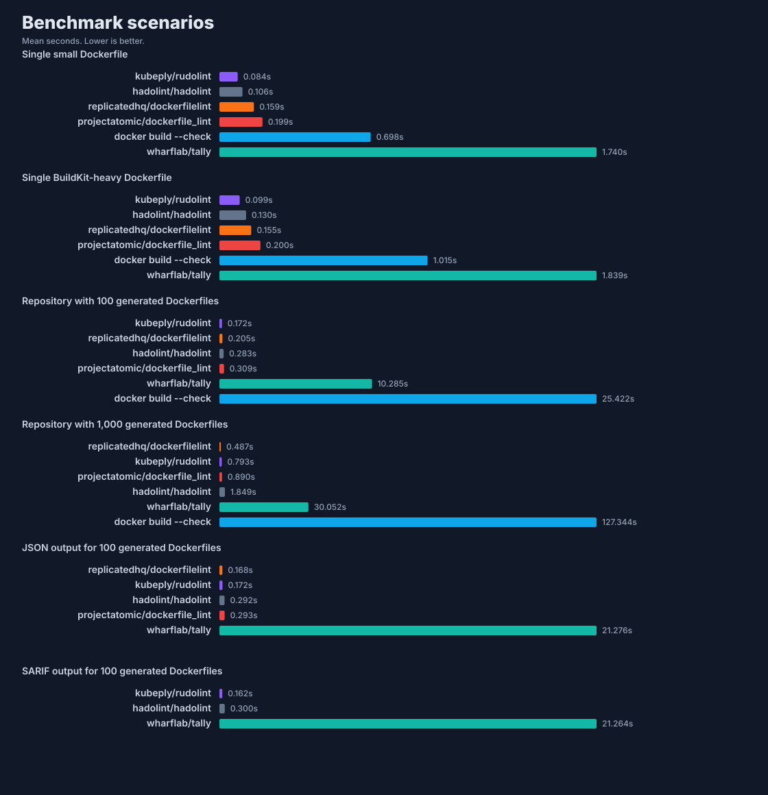

# Dockerfile Linter Benchmarks

This benchmark suite compares `rudolint` with the main Dockerfile linting
alternatives using external CLI timing. It is separate from CodSpeed: CodSpeed
guards `rudolint` internals against regressions, while this suite answers the
user-facing question, "How fast is rudolint compared with other linters?"

## Compared Tools

- `kubeply/rudolint`: this repository, built in release mode.
- `hadolint/hadolint`: pinned current GitHub release for the host platform
  ([hadolint/hadolint](https://github.com/hadolint/hadolint)).
- `wharflab/tally`: pinned current `tally-cli` package from npm
  ([npm](https://www.npmjs.com/package/tally-cli),
  [GitHub](https://github.com/wharflab/tally)).
- `docker build --check`: Docker's native BuildKit build checks through the
  locally installed Docker CLI
  ([Docker build checks](https://docs.docker.com/reference/build-checks/)).

Legacy Dockerfile linters such as `replicatedhq/dockerfilelint` and
`projectatomic/dockerfile_lint` are intentionally not included because they have
not shipped modern rule coverage in years. Docker image scanners such as Trivy,
Dockle, and Grype are also excluded because they analyze built images or SBOMs
rather than Dockerfile source.

## Headline Result

The root README uses the 1,000-file repository benchmark as the headline chart:


## Scenario Results

The secondary chart keeps the internal comparisons visible without crowding the
root README:



## Methodology

The runner uses `hyperfine` for timing, with warmups and repeated runs. It
generates deterministic corpora under `target/dockerfile-linter-bench/corpus`
so benchmark inputs are reproducible but do not add 1,000 fixture files to the
repository.

After this workflow exists on `main`, the checked-in results should be refreshed
through the `Dockerfile linter benchmarks` GitHub Actions workflow on a Depot
`depot-ubuntu-24.04` runner. Local runs are useful for investigation, but should
not be treated as the canonical public chart.

Scenarios:

- single small Dockerfile
- single BuildKit-heavy Dockerfile
- 100 generated Dockerfiles
- 1,000 generated Dockerfiles
- JSON output for 100 generated Dockerfiles, where supported
- SARIF output for 100 generated Dockerfiles, where supported

The 100-file and 1,000-file corpora contain unique Dockerfiles. They vary base
images, package-manager commands, labels, ports, cache mounts, build arguments,
and copied paths. The benchmark does not duplicate the same Dockerfile hundreds
of times.

Rule coverage and diagnostic counts are not scored in these charts because each
tool has a different rule catalog. The suite measures CLI elapsed time for the
closest supported operation in each tool.

Lint findings are treated as successful benchmark executions. Exit codes are
normalized per tool because Dockerfile linters disagree on whether findings
should return `0` or `1`.

Each tool/scenario datapoint is timed independently. A benchmark command that
fails on the publishing runner is retried and then omitted from the charts if it
still cannot complete; the omission is recorded in `results/latest.json` so the
workflow can keep publishing the successful datapoints without hiding the
failure.

## Reproduce

Prerequisites:

- Python 3.10 or newer. The runner uses only the standard library.
- Node.js and npm for the locked npm-based tools.
- Docker CLI with Buildx for Docker's native build checks.
- `hyperfine` for external command timing.

Install `hyperfine` on macOS:

```bash
brew install hyperfine
```

On Linux, use your distribution package manager or `cargo install hyperfine`.
On Windows, run the suite through WSL2; native Windows hosts are not supported
yet because the runner only downloads Linux and macOS `hadolint` assets.

Then run:

```bash
python3 scripts/dockerfile-linter-bench.py run --runs 5 --warmup 5
```

The script will:

1. build `rudolint` in release mode,
2. download the pinned `hadolint` release for the host platform,
3. install the pinned npm package for `tally-cli` into
   `target/dockerfile-linter-bench/tools/node`,
4. use the local Docker CLI for `docker build --check`,
5. generate `results/latest.json`, `results/tool-versions.json`,
   `results/headline.svg`, and `results/scenarios.svg`.

Run a narrower pass while iterating:

```bash
python3 scripts/dockerfile-linter-bench.py run --scenario repo-1000 --runs 3 --warmup 1
```

Refresh the checked-in artifacts through GitHub Actions:

```bash
gh workflow run dockerfile-linter-benchmarks.yml
```

Use the explicit version flags when intentionally refreshing the comparison:

```bash
python3 scripts/dockerfile-linter-bench.py run \
  --hadolint-version v2.14.0 \
  --tally-version 0.41.0
```

## Current Tool Versions

The latest recorded benchmark run writes exact tool versions to
[`results/tool-versions.json`](results/tool-versions.json). Refresh that file
whenever the charts are regenerated.
